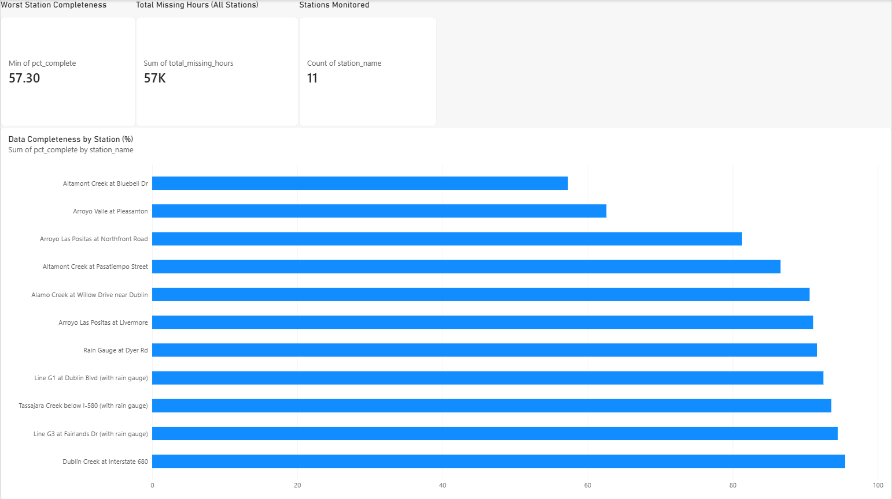
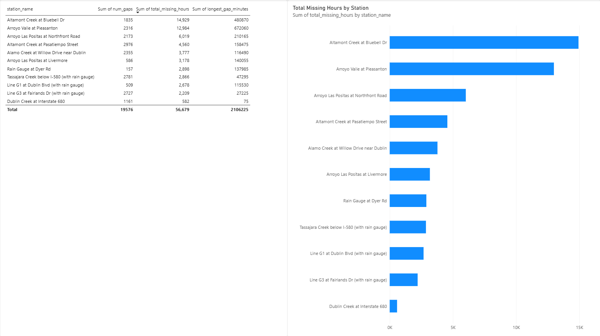

# Zone 7 StreamTracker: Sensor Data Quality Analysis

**Question:** Which stream/rainfall sensor stations have the most data quality
issues, and what's a reliable way to detect and handle gaps in 15-minute
interval sensor data?

## Background

[Zone 7 Water Agency](https://www.zone7waterca.gov/) manages flood protection
and water resources for California's Tri-Valley region and publishes 15-minute
interval streamflow and rainfall sensor data through their public
[StreamTracker portal](https://streamtracker.zone7waterca.gov/api/download.html),
starting October 2022. The agency explicitly flags the data as preliminary and
containing gaps/errors. That makes it a good real-world data hygiene case
study rather than a pre-cleaned dataset.

## Stations Analyzed

This project uses a fixed set of 11 stations (14 files, since combo stations
have both a Stream and Rain export). Full list, types, and date ranges:
[`docs/stations.md`](docs/stations.md). Download those specific stations to
reproduce these exact results, or add more CSVs to `data/raw/` to extend
the analysis to additional stations.

## Approach

1. **Ingest.** Manually download 15-minute interval CSVs for a set of stream
   and rain stations from the StreamTracker portal, then load them with
   `scripts/load_csvs.py` into SQLite (`raw_readings`) in **wide format**:
   one row per station+timestamp, with separate columns per metric (Stage,
   Flow, Precipitation, Water Temperature, Quality). The loader also fixes a
   malformed-header bug in the source export, merges a duplicated station
   identity, and dedupes a fully-redundant file export. See
   `docs/data_quality_findings.md` for details on all three.
2. **SQL-driven quality analysis.** All detection logic lives in SQL, not
   pandas (`sql/data_quality_analysis.sql`, run via `scripts/run_analysis.py`):
   - Station identity / dedup checks
   - Completeness (% of expected 15-min readings actually present, per station)
   - Gap detection via window functions (`LAG` to compare consecutive timestamps)
   - Per-station gap scorecard (count, total missing time, longest outage)
   - Metric-level null detection (a sensor that's always blank versus a timing gap)
3. **Findings & recommendation.** Documented in
   [`docs/data_quality_findings.md`](docs/data_quality_findings.md), including
   a gap-handling strategy (interpolate, exclude, or flag) grounded in the
   actual gap-length distribution found in this data.

## Results

Across 11 stations and up to ~4 years of 15-minute data, completeness ranged
from **57.3% to 95.5%**. **Altamont Creek at Bluebell Dr** and **Arroyo Valle
at Pleasanton** were the worst performers, each missing 12,000+ hours of
readings, largely driven by single multi-day sensor outages rather than
routine gaps (98.4% of all gaps resolve within 2 hours).

The data pipeline itself introduced more apparent "bad data" than the
sensors did. A duplicated station identity and a fully-redundant file export
together accounted for ~19% of initially-loaded rows being exact duplicates.
A floating-point rounding issue in date-difference math produced ~380,000
false "gaps" before the detection threshold was corrected.
Full write-up, numbers, and methodology: [`docs/data_quality_findings.md`](docs/data_quality_findings.md).

## Cloud Migration (Azure SQL Database)

To put a real project behind my Azure Data Fundamentals (DP-900)
certification, I migrated this pipeline from local SQLite to a free-tier
Azure SQL Database and re-ran the full analysis there. Every finding matched
the original SQLite results.

**What moved:** `raw_readings` (1,105,536 rows across 11 stations) loaded
into Azure SQL Database's serverless free tier (100,000 vCore-seconds/month,
32 GB storage, auto-pause enabled so it can't generate a bill) via
`scripts/load_csvs_azure.py`. The analysis logic was ported to
`sql/data_quality_analysis_azure.sql` and re-run through
`scripts/run_analysis_azure.py`.

**Dialect differences found and fixed** — SQLite to T-SQL isn't a drop-in
swap:

1. **Schema reset.** SQLite deletes the file to rebuild clean; Azure SQL uses
   `IF OBJECT_ID('raw_readings','U') IS NOT NULL DROP TABLE raw_readings`.
2. **Column typing.** SQLite's loose `TEXT` columns became explicit
   `NVARCHAR(50)` — `TEXT` is a deprecated type in Azure SQL.
3. **Column introspection.** SQLite's `PRAGMA table_info(...)` has no Azure
   SQL equivalent; replaced with a query against `INFORMATION_SCHEMA.COLUMNS`.
4. **Row deduplication.** SQLite's implicit `rowid` doesn't exist in Azure
   SQL; replaced with `ROW_NUMBER() OVER (PARTITION BY station_id, timestamp
   ORDER BY (SELECT NULL))` inside a CTE, deleting rows where `rn > 1`.
5. **Date arithmetic.** SQLite's `JULIANDAY()` has no T-SQL equivalent;
   replaced with `DATEDIFF(minute, ...)`, which returns a clean integer with
   no floating-point rounding. This eliminated the `>20`-minute gap-detection
   workaround the SQLite version needed to dodge ~380,000 floating-point-noise
   false gaps — the T-SQL version uses a clean `>15`-minute threshold instead.
6. **Bulk insert performance.** Row-by-row inserts are effectively free
   locally but impractically slow over a real network connection; switched to
   `pyodbc`'s `fast_executemany` with batched `executemany()` calls.
7. **`GROUP BY` strictness.** T-SQL enforces the ANSI SQL standard — every
   non-aggregated selected column must appear in `GROUP BY`. SQLite silently
   allows an ungrouped column and picks an arbitrary matching row. Fixed by
   adding the functionally-dependent `station_name` column to the `GROUP BY`.

**Result:** every completeness percentage, gap count, and total-missing-hours
figure matched the original SQLite findings exactly — same 57.3%–95.5%
completeness range, same two worst-performing stations, same row count after
dedup (1,105,536). A two-page Power BI dashboard (completeness by station with
KPI cards, plus a gap-detail table and missing-hours chart) sits on top of the
Azure SQL Database for at-a-glance review.

Full migration plan and rationale:
[`docs/azure_migration_plan.md`](docs/azure_migration_plan.md).

**Security note:** Azure SQL credentials are never committed to this repo —
`load_csvs_azure.py` and `run_analysis_azure.py` read the password from the
`AZURE_SQL_PASSWORD` environment variable at runtime.

## Dashboard

A two-page interactive Power BI dashboard connected directly to the Azure SQL
Database:

- **Overview**: KPI cards (worst-station completeness, total missing hours
  across all stations, stations monitored) plus a bar chart of data
  completeness by station, sorted worst to best.

- **Detail**: a sortable gap-summary table (gap count, total missing hours,
  longest single gap per station) plus a bar chart of total missing hours by
  station.


The full interactive report is available at `powerbi/zone7_dashboard.pbix`.
Since it queries Azure SQL Database directly (Import mode against the same
queries in `sql/data_quality_analysis_azure.sql`), the file opens and
displays this cached data standalone, but hitting Refresh requires Azure SQL
credentials the file doesn't store.

## Project Structure

```
├── data/
│   ├── raw/                          # manually downloaded station CSVs (not committed)
│   └── processed/
│       └── zone7.db                  # SQLite: raw_readings (wide format, not committed)
├── scripts/
│   ├── load_csvs.py                  # CSV to SQLite, incl. header-bug fix, dedup, station merge
│   ├── run_analysis.py               # runs sql/data_quality_analysis.sql, prints all results
│   ├── load_csvs_azure.py            # Azure SQL version of load_csvs.py
│   └── run_analysis_azure.py         # Azure SQL version of run_analysis.py
├── sql/
│   ├── data_quality_analysis.sql     # all gap-detection / quality-scoring queries (SQLite)
│   └── data_quality_analysis_azure.sql  # T-SQL port of the same queries (Azure SQL)
├── powerbi/
│   └── zone7_dashboard.pbix          # two-page dashboard, connected to Azure SQL Database
├── screenshots/
│   ├── overview.png                  # dashboard page 1: KPIs + completeness chart
│   └── detail.png                    # dashboard page 2: gap table + missing-hours chart
├── docs/
│   ├── stations.md                   # exact stations/files used, for reproducibility
│   ├── data_quality_findings.md      # the actual write-up / deliverable, with real numbers
│   └── azure_migration_plan.md       # step-by-step Azure SQL migration plan and rationale
└── README.md
```

## How to Run

```bash
pip install pandas

# 1. Download CSVs for the stations listed in docs/stations.md from
#    https://streamtracker.zone7waterca.gov/api/download.html
#    and place them in data/raw/

cd scripts
python load_csvs.py         # loads CSVs to ../data/processed/zone7.db
python run_analysis.py      # runs all SQL queries, prints results to the terminal
```

`run_analysis.py` reproduces every number in `docs/data_quality_findings.md`
directly from the SQL file. No manual query copy-pasting needed.

To run the Azure SQL Database version instead (see
[`docs/azure_migration_plan.md`](docs/azure_migration_plan.md) for full
setup steps):

```bash
pip install pyodbc

# set your Azure SQL password (never commit it):
#   PowerShell:  $env:AZURE_SQL_PASSWORD = "your_password_here"

cd scripts
python load_csvs_azure.py       # loads CSVs into Azure SQL Database
python run_analysis_azure.py    # runs sql/data_quality_analysis_azure.sql against it
```

## Tech Stack

Python (pandas, pyodbc), SQL (SQLite and T-SQL/Azure SQL Database: window
functions, CTEs), Azure SQL Database, Power BI, Zone 7 StreamTracker portal
(manual CSV export)

## Notes on Data Source

Zone 7's data is preliminary and may contain agency-side errors independent of
transmission gaps. This project focuses specifically on detecting missing
and structurally anomalous readings from a data-engineering standpoint. It
does not validate the underlying sensor accuracy.
